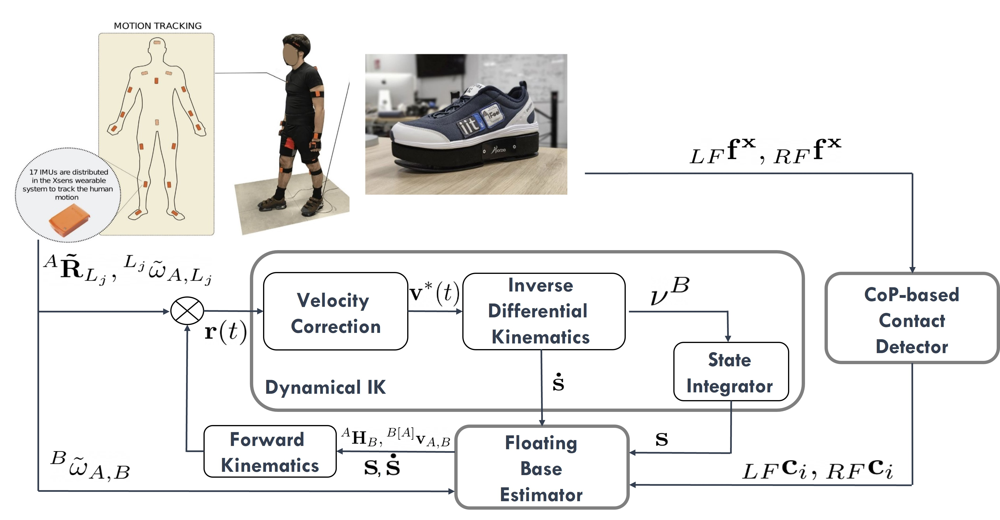
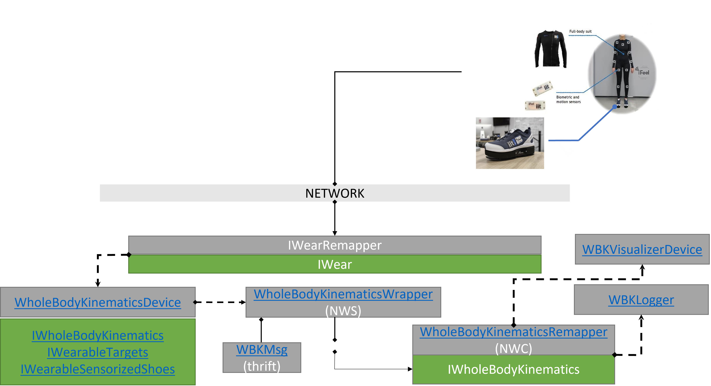
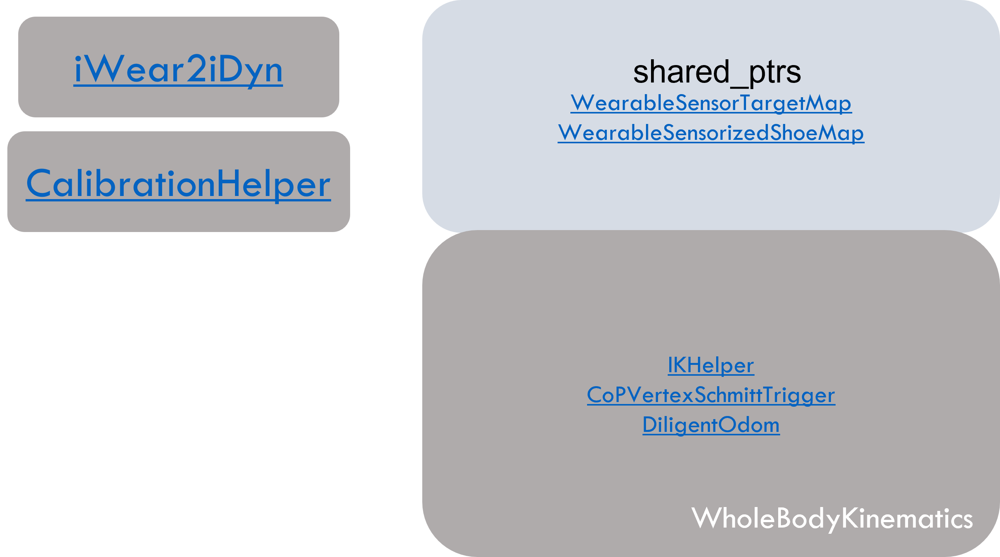
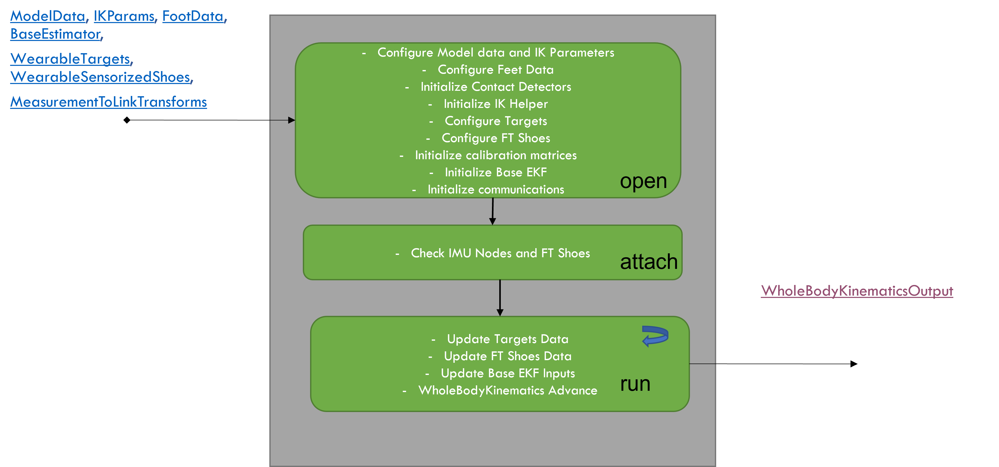
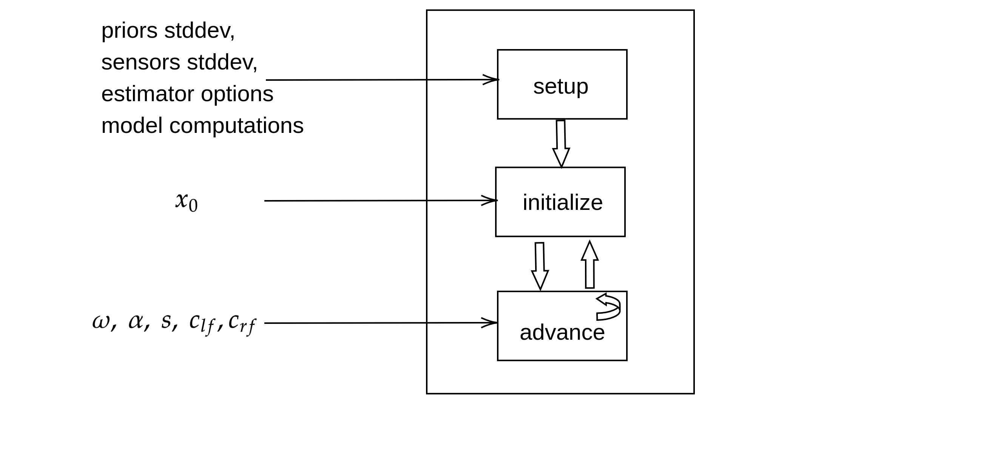

#### System Architecture

The system architecture is composed of three macro-blocks to tackle the human motion estimation problem.
Firstly, a **dynamical optimization based IK** block is used to compute the joint configuration from the target measurements of the distributed IMUs with the knowledge of the human model.
The dynamical optimization approach aims to drive the state configuration $(\mathbf{q}(t), \nu(t))$ such that the forward and differential kinematics of the system converge to the reference target measurements in multiple time steps.

Meanwhile, a **contact detection** block infers ground contact using wrench measurements from the sensorized shoes.
A rectangular approximation is used for the foot geometry to infer the contact state of candidate contact points on the foot based on the local center of pressure (CoP).

Finally, the outputs of these two blocks are passed to an **EKF block**.
The EKF is formulated as a filter over matrix Lie groups employing right-invariant, left-invariant, and non-invariant observations in order to estimate the floating base pose and velocity along with the position of the candidate contact points with respect to an inertial frame.
The EKF block is activated after the dynamical IK block has converged below a certain error threshold for a reliable state initialization, which is crucial for filter convergence.

Wearable data is streamed by the sensor suit across the network over a port. `IWearRemapper` device acts as a network wrapper client that wraps around this port and allows accessing the sensor data using an `IWear` interface.

`WholeBodyKinematicsDevice` attaches itself to the `IWearRemapper` to access the sensor measurements and internally runs the computations for whole body kinematics estimation. It exposes the outputs using a `IWholeBodyKinematics` interface which is a derived class of `IHumanState` interface.

Meanwhile, a `WholeBodyKinematicsWrapper` which is a Network Wrapper Server (NWS), and ideally should be called as `WholeBodyKinematicsNWS` attaches itself to `WholeBodyKinematicsDevice` to access the estimated outputs using the `IWholeBodyKinematics` interface.

All the estimated data available over the `IWholeBodyKinematics` interface is serialized into a `WholeBodyKinematicsMsg` using the thrift mechanism in order to published onto a port over the network.

`WholeBodyKinematicsRemapper` which is a Network Wrapper Client (NWC), and ideally should be called as `WholeBodyKinematicsNWC` reads the port and deserializes the `WholeBodyKinematicsMsg` and exposes the data to client side devices.

`WholeBodyKinematicsVisualizerDevice` and `WholeBodyKinematicsLogger` are such client side devices that attach themselves to `WholeBodyKinematicsRemapper` and access the estimated outputs through the `IWholeBodyKinematics` interface for visualization and debugging.

`WholeBodyKinematics` exposes shared pointers of `WearableSensorTarget` and `WearableSensorizedShoe`. These are objects that hold the raw measurements in input buffers and provide calibrated measurements as outputs. These shared pointers are accessed by objects from outside for setting the inputs and asynchronously calling the calibration methods to store an extrinsic calibration matrices such that the raw input measurements are transformed to appropriate reference frames at the outputs.

`iWear2iDyn` draws wearable sensor data, using the `IWear` interface, from the network streamed by a sensor suit through the `IWearRemapper`and sets the inputs for the `WearableSensorTargets` and `WearableSensorizedShoes` using the shared pointer.

`CalibrationHelper` performs model-based extrinsic calibration asynchronously on RPC calls, in order to store the sensor-to-link, estimator-world-to-sensor-world transforms in a calibration storage class maintained by the `WearableSensorTargets`.

#### WholeBodyKinematics Workflow

#### Extended Kalman Filter Structure

The image below is taken from [ami-iit/paper_ramadoss_2021_icra_proprioceptive-base-estimator](https://github.com/ami-iit/paper_ramadoss_2021_icra_proprioceptive-base-estimator/blob/main/matlab/README.md). However, the Base EKF submodule, otherwise known as **DiligentOdom** (Discrete Lie Group Extended Kalman Filter for Legged Odometry) is implemented to retain the same structure. Please refer to the link for more details.

Go back to the [main README](./../README.md).